# 1. 2D Filters
## 1. Edge detection filter
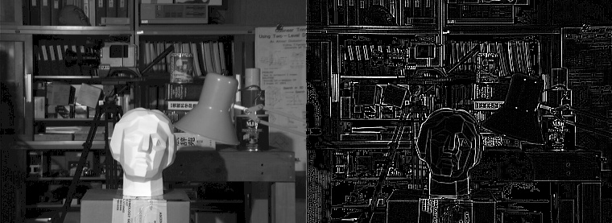
## 2. Sharpening filter
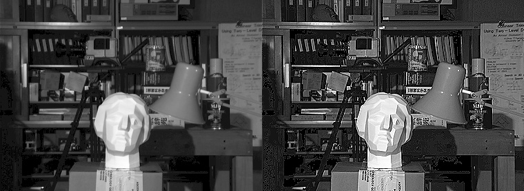
## 3. Emboss filter
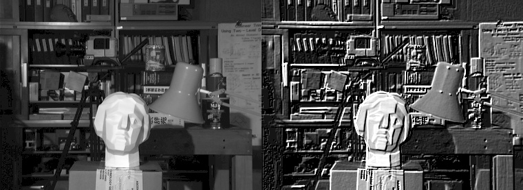
## 4. Identity filter
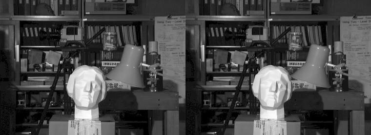
## 5. My filter
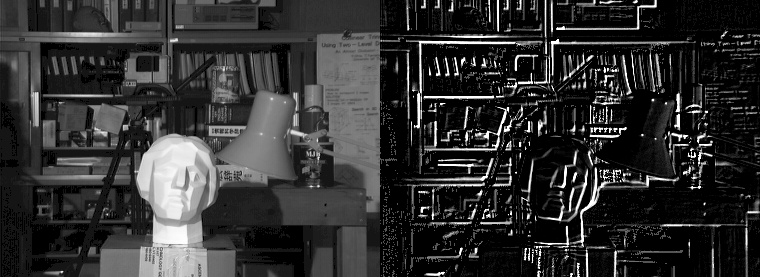
# 2. Average Filters
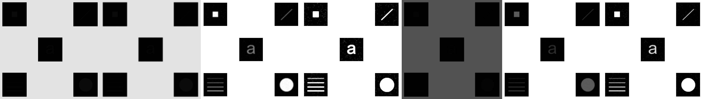
# 3. Median Filters
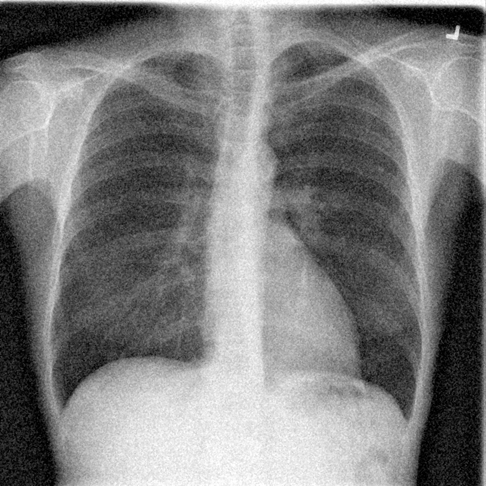
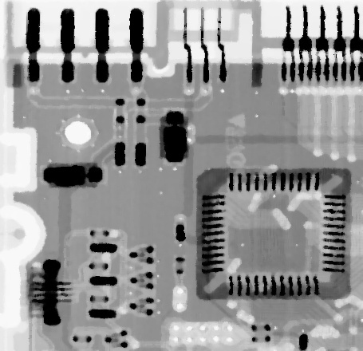
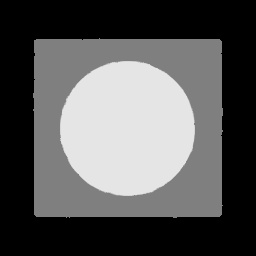

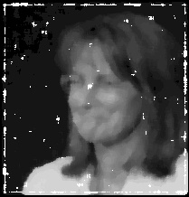

# 4. Histogram Equalization 
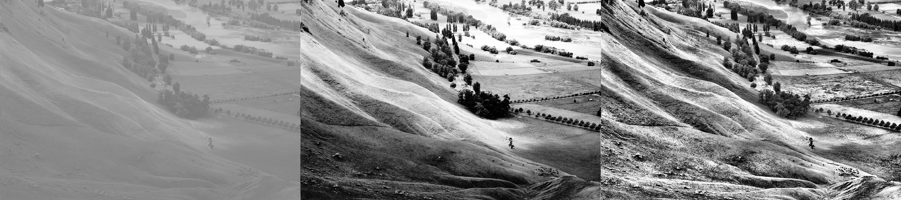
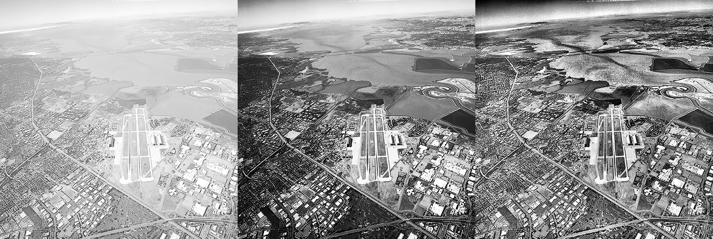
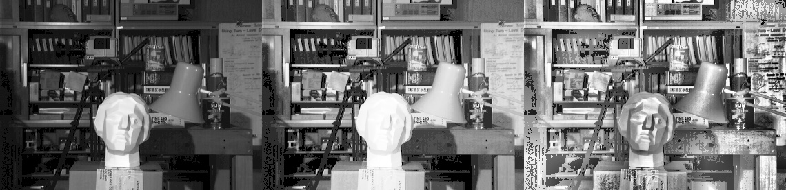